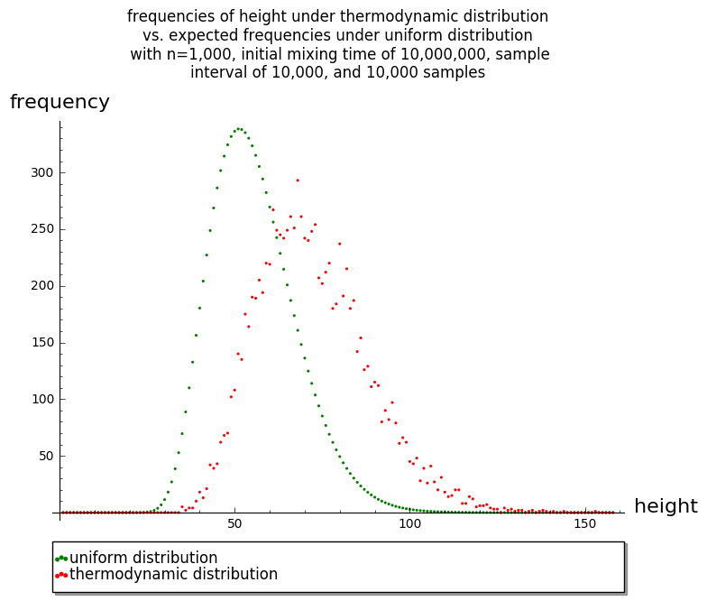

# RNA Markov-Chain Monte Carlo

## What is this project?

#### Background
- In this project, we represent RNA folding structures as [Dyck words](https://en.wikipedia.org/wiki/Dyck_language): strings of *n* 1's and *n* 0's such that no initial portion of the string contains more 0's than 1's. This is one of the structures that are enumerated by the [Catalan numbers](https://en.wikipedia.org/wiki/Catalan_number) - a tree representation is more intuitive for representing RNA structures, but the Dyck word representation is much easier to use for the purposes of this project.
- We define a "0-1 move" on any of these strings as an exchange of a randomly selected 1 with a randomly selected 0, such that this exchange does not break the Dyck word property of not containing more 0's than 1's in any initial portion.
- We use an energy function that assigns a thermodynamic score to each structure. A lower score means that the structure is more energetically favorable, so as we model the dynamic folding of an RNA molecule into different structures, structures with lower scores are more likely to form than structures with higher scores.

#### Outputs
- We record characteristics of the structures that occur during the folding process, using the tree interpretation. For example, we consider tree height, root degree, and number of leaves.
- We vary certain parameters of the energy function used to score structures, and observe how this changes the distribution of each characteristic that we are interested in.

#### Sample plot

## Dependencies
- Python
	- 2.6+
	- PyPy is not required, but in my experience it has led to a speedup of 5-10x over CPython (the default implementation of Python)
	- Matplotlib and NumPy to run `create_histograms.py`

- Sage
	- 7.6+, but earlier versions should work too

- R
	- The [coda](https://cran.r-project.org/web/packages/coda/index.html) package for `calculate_effective_sample_size.R` and `calculate_gelman_convergence.R`.
	- The [dgof](https://cran.r-project.org/web/packages/dgof/index.html) package for `calculate_kolmogorov_smirnov.R` and `calculate_kolmogorov_smirnov_averages.R`

## Organization
- Scripts are organized into four directories within the `bin` directory:
	- `io`: Scripts that only write text data to some other directory (and read in data from another directory first, in the case of `write_plot_data.sage`)
	- `main`: Core scripts for running or testing the simulation.
	- `plotting`: Scripts for generating plots.
	- `stats`: Scripts for calculating various statistics (effective sample size, Gelman-Rubin convergence diagnostic, and Kolmogorov-Smirnov for testing the equality of two probability distributions).

- Scripts should be run from the top-level directory (the one where this README is located) so that they produce their outputs in the right places.

- The `data` directory has three subdirectories:
	- `by_frequency`: Contains information about the frequency with which each characteristic had a certain value during an MCMC run. This is generated at the end of `mcmc.py` and is used for creating plots.
	- `by_sample`: Each file in this directory corresponds to a certain characteristic during a single MCMC run. Each line gives one sample's value for a characteristic.
	- `procesed_plot_data`: Generated by `write_plot_data.sage`, and used as direct input for plotting.

## Running the chain
- `mcmc.py` requires four positional arguments: *n*, initial mixing time, gap size (number of moves to make before recording each sample), and number of samples. It also requires either the `--uniform` or `--nntm` flag to specify which distribution to use when making each move.

- If using `--nntm`, you may also specify parameters for the energy function. The default values are 2.3, 1.3, -0.4, and -14.6. To specify these parameters, you should use the flags `--c1` through `--c4`, e.g. `--c1 -0.9 --c2 -1.8 --c3 -1.7 --c4 -8.8`. Either all or none of these parameters need to be specified, to guard against user error.

- Use the `--no_energy_in_filename` flag when running `mcmc.py` to exclude the energy parameters from the filename. This will make the filenames of the generated data compatible with old scripts (plotting of characteristics and statistics including Gelman-Rubin and Kolmogorov-Smirnov).

- Each time 10% of the total number of samples has been collected, the program will print a message and append per-sample data for each characteristic to files in the `data/by_sample` directory. This is done to reduce memory usage of the program since after writing these values, they can be discarded.

- After the program finishes, data about frequencies of characteristics (how many times each characteristic had a certain value) is written to the `data/by_frequency` directory.

- Additional arguments (optional):
	- `--prefix PREFIX`: Attaches the given prefix to the beginning of all data files. Used in scripts that run `mcmc.py` multiple times so that the results are not overwritten each time.
	- `--start_word_source START_WORD_SOURCE`: If specified, this file path will be used to load a text file containing the starting word. The file should only have one line, containing 1's and 0's with no spaces in between. If not specified, a starting word of [1]*n + [0]*n will be used. This argument is used for energy calibration experiments, to start the chain from structures that are far from each other.

## Creating plots
- To plot data output by the chain, the first step is to run `write_plot_data.sage`. This has slightly different behavior depending on whether the `--uniform` or `--nntm` flag is used.
	- With either flag, the first command line argument should be your value of *n* (1000 in most cases).
	- With the `--uniform` flag, you should provide initial mixing time, sample interval, and number of samples as command line arguments, in that order (this order is the same for any script in the project that requires command line arguments). For each characteristic that has an available CDF (height, number of leaves, root degree, and contact distance sums), a text file with two columns (experimental and expected values) will be created in the `data/processed_plot_data` directory.
	- With the `--nntm` flag, you should first provide uniform initial mixing time, sample interval, and number of samples as command line arguments. Then you should provide these three values used for the run under the nntm distribution. This will create files in the `data/processed_plot_data` directory, comparing experimental values under the nntm distribution to expected values under the uniform distribution. In addition, it will create two files comparing experimental values under the nntm distribution for ladder distance and contact distance averages with the experimental values for these characteristics under the uniform distribution.
	- Note: The comparison of nntm experimental data to uniform experimental data when using the `--nntm` flag is the reason that both uniform and nntm parameters are required as command line arguments in that case.

- After the appropriate data is in the `data/processed_plot_data` directory, use the `create_scatterplots.sage` and `create_histograms.py` scripts to create plots.
	- `create_scatterplots.sage`
		- Creates scatterplots for characteristics that are integer-valued: ladder distance, height, contact distance sums, number of leaves, and root degree.
		- Requires as command line arguments *n*, initial mixing time, gap size, and number of samples, followed by one of `--uniform` or `--nntm`.
	- `create_histograms.py`
		- Creates histograms for the other characteristics (which are non-negative and real-valued): average branching and contact distance averages.
		- Requires as command line arguments *n*, uniform initial mixing time, gap size, and number of samples, and nntm initial mixing time, gap size, and number of samples.
	- Both of these scripts save plots to the `plots` directory.

## Statistics scripts
- Scripts located in `bin/stats/`. Detailed descriptions of the uses of these scripts is in the **Experiments** section. This section describes instructions for use of these scripts and a short description of their functions.

| Script name  | Inputs | Function | Output |
| :-----------:  | :------: | :-----: | :-----: |
| `calculate_effective_`  `sample_size.R`  |  At the top of the file: values for *n*, initial mixing time, gap size, and number of samples, as well as which characteristics to examine, and which initial parts of the chain to calculate gelman convergence for ("limits"). | For each given characteristic, calculates the effective sample size (an estimate for the number of independent samples) for each chain. | Prints the mean and standard deviation of effective sample size, for each characteristic and number of samples. |
| `calculate_gelman_`  `convergence.R`  |  At the top of the file: values for *n*, initial mixing time, gap size, and number of samples, as well as which characteristics to examine, which initial parts of the chain to calculate gelman convergence for ("limits"), and optionally a limit for which a plot of number of iterations vs. shrink factor will be produced. | For each given characteristic, examines first portions of each of four chains (the first 1,000 samples, the first 10,000 samples, etc.) and uses Gelman and Rubin's convergence diagnostic to calculate a shrink factor. This diagnostic compares the variance between the chains to the variance within each chain, and produces a "shrink factor." A shrink factor of 1 indicates that between variance and within variance are equal, whereas a larger shrink factor indicates that there is still a noticeable difference in the two variances.  | Prints estimate of shrink factor and its upper confidence limit for each characteristic and limit value. |
| `calculate_kolmogorov_`  `smirnov_averages.R` | At the top of the file: values for *n*, initial mixing time, gap size, number of samples, and distribution (nntm or uniform). Also, a list of which characteristics to examine, and a list of which initial parts of the chain to calculate KS for ("limits"). | For each given characteristic, examines first portions of each of four chains (the first 1,000 samples, the first 10,000 samples, etc.) and calculates KS for that portion of each chain, comparing it to the expected values under the uniform distribution. | For each characteristic and limit, prints the mean KS statistic and mean p-value. A p-value below our significance level of 0.05 indicates that the two underlying distributions definitely differ. A p-value of 0 can be expected for the nntm distribution, and a p-value much larger than 0.05 can be expected when the uniform distribution is used for experimental values. |
| `calculate_kolmogorov_`  `smirnov.R` | At the top of the file: values for *n*, initial mixing time, gap size, number of samples, and energy parameters for NNTM data filenames. Also, a list of which characteristics to examine, a list indicating whether a 1-sample discrete or 2-sample continuous KS test should be performed for a characteristic, a list indicating which directory (`data/by_sample` or `data/by_frequency`) data for a characteristic can be found in, and a list indicating the maximum value that each characteristic can have. | **Note**: this script is used for a different experiment than the three above scripts, and requires data from only one uniform and one nntm MCMC run, whereas the above scripts require data from multiple runs under the uniform or nntm distribution.   For each given characteristic, uses the Kolmogorov-Smirnov test to test whether values for characteristics obtained under the nntm distribution could have been generated by the uniform distribution.    Unlike the other scripts described here, this script expects NNTM data filenames to include the parameters for the energy function. Set `use_energy` at the top of the file to `FALSE` to remove this behavior. | Prints KS statistic and p-value for each characteristic. A p-value below our significance level of 0.05 indicates that the two underlying distributions definitely differ. |

## MCMC scripts
- Scripts located in `bin/main/`, which run `mcmc.py` with various parameters . Use cases for each of these scripts are described in the **Experiments** section.

| Script name  | Inputs | Function | Output |
| :-----------:  | :------: | :-----: | :-----: |
| `original_energy_function_`  `calibration_runs.sh` | none | Bash script to run `mcmc.py` with the uniform distribution four times, and with the nntm distribution four times. For each distribution, starts once from each of the four vertices written in `write_polyhedron_vertices.py`. | `mcmc.py` produces output in the `data/by_frequency` and `data/by_sample` directories. All data files generated from this script start with `run1`, `run2`, `run3`, or `run4`. |
| `new_energy_function_`  `calibration_runs.sh` | none | Same function as the previous script, but only uses the nntm distribution and uses updated energy parameters. | Same as above. |
| `multiple_energy_functions_`  `sample_data_runs.sh` | none | Runs `mcmc.py` to collect a small amount of data using multiple energy functions, so that you can start experimenting with plotting this data. | Files in `data/by_frequency` and `data/by_sample` with data from runs under the different energy functions. |

## I/O scripts
- Scripts located in `bin/io/`, which read and write data to and from different directories . Detailed descriptions of the uses of these scripts is in the **Experiments** section. This section describes instructions for use of these scripts and a short description of their functions.

| Script name  | Inputs | Function | Output |
| :-----------:  | :------: | :-----: | :-----: |
| `write_cdfs.sage`  | Via command line: value for *n*.   | For each of the characteristics of contact distance sums, number of leaves, root degree, and height, this script writes data to a file in the `expectations` directory. The *n*th line in one of these files gives the probability that under the **uniform** distribution, a sample will have a value less than or equal to *n* for the file's characteristic. | Creates text files named, for example, `num_leaves_n=1000_cdf.txt` in the `expectations` directory. |
| `write_polyhedron_`  `vertices.py` | At the top of the file: value for *n*. | For the given value of *n*, creates Dyck word representations of four vertices of the bounding polyhedra, depicted in Figure 3 in page 765 of Hower and Heitsch: Parametric analysis of RNA branching configurations (2011). | Creates text files `v1.txt`, `v2.txt`, `v3.txt`, and `v4.txt` in the `start_words` directory. |
| `write_random_`  `Dyck_words.sage` | Via command line: value for *n*, and number of random words to generate. | Uses Sage's `DyckWord` `random_element()` method to generate random Dyck words of order *n*. | Creates text files named, for example, `random1_n=1000.txt` in the `start_words` directory. |
| `write_plot_data.sage` | Data in `data/by_frequency` and `data/by_sample`. And via command line: parameters for the MCMC run that should be processed. | Combines data generated under the uniform distribution and data generated under the thermodynamic distribution into a singe file. Also combines experimental data (from the uniform or the thermodynamic distribution) with theoretical expectations under the uniform distribution. | Files in `data/processed_plot_data/`, to be used as input for plotting scripts. |

## Experiments

#### Determining adequate parameters (gap size and initial mixing time) for uniform and nntm distributions
- `bin/io/write_polyhedron_vertices.py`
	- Generates starting points for the `original_energy_function_calibration_runs` script.

- `bin/main/original_energy_function_calibration_runs.sh`
	- Runs `mcmc.py` with the uniform distribution four times, and with the nntm distribution four times.

- `bin/stats/calculate_gelman_convegence.R`
	- For each "limit" (initial portion of the chain), we see how across-chain variance compares to within-chain variance, giving us an idea of how close the chains are to converging to the same distribution. A value below 1.1 tells us that that limit is an adequate initial mixing time.

- `bin/stats/calculate_effective_sample_size.R`
	- For a given limit (number of iterations), for each characteristic we divide number of iterations by effective sample size. Taking the minimum across characteristics tells us what gap size we can use with an initial mixing time equal to the given limit.

- (optionally) `bin/io/write_cdfs.sage`, then `bin/stats/calculate_kolmogorov_smirnov_averages.R`
	- Compares the values obtained under either the uniform or nntm in `original_energy_function_calibration_runs`to the expected values under the uniform distribution. This tells us whether we can conclude that the distributions for any of these characteristics significantly differ under the uniform vs. the nntm distributions. A p-value below 0.05 means we can conclude this, but a p-value greater than or equal to 0.05 means we cannot make any conclusion.

#### Determining mixing parameters for nntm distribution in the worst case, which we expect to lead to the slowest mixing times.
- This is similar to the previous experiment, but uses nntm parameters -0.9, -1.8, -1.7, and -8.8. See the documentation for the previous experiment for more detailed descriptions of each step.
- `bin/io/write_polyhedron_vertices.py`
- `bin/main/new_energy_function_calibration_runs.sh`
	- Runs `mcmc.py` four times with this new energy function.
- `bin/stats/calculate_gelman_convergence_new_energy_function.R`
- `bin/stats/calculate_effective_sample_size_new_energy_function.R`
	- I updated this script to look at ladder distance, contact distance averages, and average branching in addition to root degree, number of leaves, and height. But when running the updated version, the process keeps getting killed after a few minutes. So if this happens to you, remove those new characteristics from the list at the top of the file.

#### Using Kolmogorov-Smirnov to find a difference between values for characteristics under uniform and nntm distributions
- `bin/main/mcmc.py` under both uniform and nntm distributions

- `bin/io/write_cdfs.sage` so that we can compare our nntm values with expected values under the uniform distributions, for characteristics that have a CDF available.

- `bin/stats/calculate_kolmogorov_smirnov.R` to determine whether we can conclude that the distributions for any of these characteristics significantly differ under the uniform vs. the nntm distributions. A p-value below 0.05 means we can conclude this, but a p-value greater than or equal to 0.05 means we cannot make any conclusion.

#### Visually comparing values for characteristics under uniform and nntm distributions
- `bin/main/mcmc.py` under both uniform and nntm distributions

- `bin/io/write_cdfs.sage` so that we can compare our nntm values with expected values under the uniform distributions, for characteristics that have a CDF available.

- `bin/plotting/create_scatterplots.sage` and `bin/plotting/create_histograms.py` to generate scatterplots and histograms comparing data from the uniform and nntm distributions.
